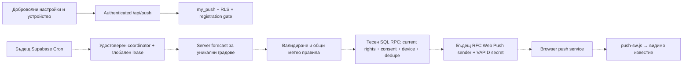

# МЕТЕО ПУЛС — ЕТАП 6Г-А: подготовка за Web Push

Дата: 9 октомври 2026 г. База: `main`, commit `63a683000af8731b353abb2fd5a83ea535ea9f6f` (PR #60). Това е подготовка, а не включване на доставка. Не са изпълнявани Production SQL, промени по акаунти, Cron задачи, генериране/качване на реални VAPID ключове или push съобщения.

## Какво е готово

- PWA manifest със стабилни `id`, `scope`, `start_url` `/`, standalone режим, PNG 192/512, отделна maskable 512, Apple Touch 180 и notification badge 96. Новите икони следват съществуващите 🌤️ и синя палитра; дизайнът и старият favicon са запазени. `scripts/generate-pwa-icons.py` възпроизвежда PNG файловете с Pillow, без runtime зависимост.
- `/push-sw.js` се регистрира на същия origin. Няма `fetch` handler, offline прогнози, Cache API, precache, OAuth прихващане или аналитика. Регистрацията на worker не е съгласие за push. Worker обработва стандартните `push`/`notificationclick` събития и отваря само `/` на собствения origin.
- Самостоятелна секция в профила: доброволен избор до 5 града и категории, име и списък на устройства, отписване и общо спиране. Има четири удобни града и добавяне по WGS84 координати/IANA зона. Любимите градове и последният разглеждан град не се добавят автоматично.
- Разрешението се иска единствено от бутона за регистрация, синхронно преди първия `await`. Няма permission prompt при вход, зареждане, записване на настройки, съгласие за аналитика или промяна на камбанката. Отказът/затварянето на prompt не създават subscription. Нов browser subscription се отписва при неуспешно записване на сървъра; вече съществуващ subscription не се унищожава при такъв отказ.
- `/api/push` използва възстановената текуща Supabase сесия и проверка през `/auth/v1/user`. SQL RPC работи с потребителския JWT и anon ключ, без service-role ключ. В отговорите няма endpoints или криптографски subscription ключове.
- Добавена, но неприложена в Production SQL миграция `20261009040000_web_push_preparation.sql`; подготовка на server forecast adapter; неактивен Edge Function scaffold.

## Три независими ограничения за активиране

1. Vercel `PUSH_REGISTRATION_ENABLED=false` по подразбиране; празен/невалиден `PUSH_VAPID_PUBLIC_KEY` също забранява POST регистрация. Не е нужна публична Vite променлива.
2. SQL `push_controls.registration_enabled=false` по подразбиране. Дори директно извикване на RPC през Supabase не заобикаля това ограничение. Промяната на контрола не е достъпна за `anon`, `authenticated` или `service_role`.
3. **Доставка няма като изпълним код.** API винаги връща `deliveryEnabled:false`. `supabase/functions/push-check/index.ts` винаги връща HTTP 503 `PUSH_DELIVERY_NOT_IMPLEMENTED`, независимо от флагове и caller credentials. Няма HTTP sender, VAPID private key или създадена Cron задача.

При липсваща миграция/API конфигурация push секцията показва недостъпна подготовка; камбанката, прогнозата, профилът и планерът продължават независимо. Съществуващите потребители не получават активни настройки. Първото отваряне на RPC създава само ред с `enabled=false`, празни градове и категории.

## Данни, RLS и управление на устройства

| Обект | Предназначение | Достъп |
|---|---|---|
| `push_preferences` | Собствен избор, общо включване/спиране, лимит на mutations | RLS по `auth.uid()`, само ограничен RPC |
| `push_devices` | Endpoint, `p256dh`, auth secret, име на устройство, SHA-256 fingerprint | RLS по `auth.uid()`, без директни table grants |
| `push_controls` | Административна забрана за регистрация | Няма клиентски grants/policies |
| `push_deliveries` | Резервирана схема за бъдещо предотвратяване на повторения | Няма producer, sender или клиентски grants |

Всички таблици имат ENABLE/FORCE RLS. `my_push` е SECURITY DEFINER с празен `search_path`, проверява `auth.uid()`, реалното съществуване/блокиране на Auth потребителя, размер и съдържание на входа, текущите Pro права, ownership и лимитите. Потребителят не подава `user_id`. Direct table privileges са отнети и от service role; бъдещият dispatcher ще изисква отделни тесни RPC и изрично прегледана миграция.

Максимум 10 устройства, 5 града, 8 категории. SHA-256 fingerprint е уникален глобално; per-account row lock и advisory lock по fingerprint предотвратяват състезания. Повторна регистрация за същия собственик обновява реда, а чужда регистрация/прехвърляне се отказва. DELETE винаги филтрира по owner и е идемпотентен, включително за чужд или вече изтрит ID. Foreign keys изтриват данните при изтриване на Auth акаунта.

Отписването първо премахва сървърния ред и едва след това отписва браузъра, когато fingerprint съвпада с текущото устройство. Отписване на друго устройство не спира текущия браузър. Общото спиране записва `enabled=false`, без да изтрива списъка с устройства; вътрешната камбанка не се променя. При загубен отговор потребителят получава непотвърдена промяна и може да презареди/повтори.

Endpoints/auth secrets са чувствителни данни за доставка: не се показват в UI, не се връщат от load, не се записват в логове/analytics. Съхранението разчита на Supabase защитата на диска и DB privileges, а не на самостоятелно column encryption. Достъпът на DB администратор/backup остава доверена граница; production backup, retention и incident процедура трябва да се прегледат преди доставка. Името на устройство е въведено от потребителя; няма browser fingerprinting или запис на User-Agent.

При смяна на акаунт origin subscription не се прехвърля автоматично. Старият собственик трябва да го отпише от своя списък; новият акаунт получава отказ при конфликт. Logout сам по себе си не означава отписване: това е отделна настройка за устройство. Преди доставка privacy текстът трябва ясно да обясни това, lock-screen видимостта и използването на push provider.

## SSRF, злоупотреба и secrets

При регистрация и директен RPC има allowlist на HTTPS endpoints: FCM, Apple Web Push, Windows `*.notify.windows.com` (един provider subdomain), Mozilla. Отхвърлят се IP/localhost, userinfo, custom port, фрагменти, suffix tricks, непознати paths/query и твърде дълги входове. Ключовете са base64url с точни размери и P-256 uncompressed префикс. API не посещава endpoint при регистрация.

Mutations са ограничени транзакционно до burst 20 и refill 20/min/account, с ограничени payloads 10 KB в Vercel/12 KB в SQL. Това ограничава успешните записи; отказани транзакции могат да rollback-нат token debit. Ограничението **не е глобална защита от DDoS**, нито rate limit за GET/Auth проверките. Преди доставка са нужни edge/WAF ограничение за POST/невалидни заявки, евтин предварителен метод/размер/auth filter и измерване на auth amplification; без платен Redis/външен доставчик в този етап.

Бъдещ sender трябва да валидира endpoint отново непосредствено преди всяка доставка, да използва `redirect:'error'`, timeout, ограничен response body и provider-only egress. Проверка на DNS резултатите за private/link-local/loopback адреси и отказ при промяна на provider схемата са допълнителни условия за активиране. Тези проверки не са реализирани като sender, защото sender липсва. P-256 точката трябва да се валидира от избраната Web Push библиотека преди encrypt/send.

VAPID публичният ключ може да достигне браузъра; private key никога не е в Vite, GitHub, browser storage, SW или Vercel Preview. Предложено бъдещо място: Supabase Edge Function secrets `PUSH_VAPID_PRIVATE_KEY`, `PUSH_VAPID_PUBLIC_KEY`, `PUSH_VAPID_SUBJECT` (mailto/HTTPS contact). Генериране с проверена RFC 8292 библиотека, отделни ключове за изолиран тестов проект и Production; без real keys в този PR. Ротация изисква план за повторно доброволно абониране; да не се сменя публичният ключ под вече записани devices без миграция.

## Предложена бъдеща Cron/Edge архитектура — НЕ Е АКТИВИРАНА

Пунктираните връзки са следващ етап. Scaffold не чете DB и не извиква `server/push-forecast.js`.

Предложение: една Cron задача на 15 минути (96 проверки/ден), с отделни ограничени batches и lease, без застъпване на един и същ cycle. `pg_cron` → `pg_net` → Edge endpoint; URL и отделен scheduler secret в Supabase Vault, без публичен browser trigger. Не използвайте anon key като scheduler authentication, не приемайте всеки потребителски JWT и не разчитайте на изключен `verify_jwt` без собствена проверка. Проверка на постоянния scheduler secret/подпис, cycle ID, допустимия времеви прозорец и rate limit трябва да предхожда всяко DB четене. Няма runnable `cron.schedule` инструкция или промяна във `vercel.json` за Cron.

`server/push-forecast.js` е проверен Node adapter, който извлича собствена 72-часова прогноза от фиксиран Open-Meteo origin, максимум 150 KB и timeout 8 s, без redirects. Проверява IANA зона, units, текущ timestamp ±90 min, последователни epoch часове, размер/дължини на масивите и диапазони през съществуващия planner validator. Snapshot над 15 min се отказва; непълни/невалидни данни не измислят предупреждения. При DST повторени локални часове validator отказва двусмислен snapshot безопасно; бъдещият worker може да подобри това с изцяло epoch-based изчисления. Преди Edge packaging трябва да се адаптират Node Buffer dependencies/споделените модули и да се тества в действителния Deno runtime.

Браузърно изпратените прогнози към старата камбанка/планер остават непроменени и **не са източник за push**. Изчислените събития трябва да се кешират кратко само на сървъра по реални координати+зона+units+version, за да не се извличат/изчисляват отделно за всеки потребител. Няма browser/SW forecast cache. Прогнозните thresholds са ориентировъчни, не официални НИМХ сигнали: rain ≥10 mm/h, storm WMO 95/96/99, wind ≥60 km/h, feels-like ≤−15/≥40 °C.

Free опасното време се филтрира само по избраните категории, не по Pro. Personal walk/garden/sport използват съществуващите правила и изискват действителни `get_my_entitlements()` резултати (`plan='pro'`, `planner:advanced`), а не JWT metadata, кеширан UI план или стойност от браузъра. SQL проверява правата при settings/registration. Бъдещият reservation/send RPC трябва повторно да проверява current consent, account ban, subscription status и entitlement непосредствено преди send; отнет Pro не трябва да доставя personal събития дори при стар JWT. При понижаване общият stop остава достъпен; UI премахва невалидните personal категории при ново записване.

За duplicates: unique `(device_id,event_key)` ledger, транзакционно reserve преди изпращане, глобален lease за cycle, стабилна дневна identity по град/зона/категория за personal препоръки (съобразена с PR #60). Risk събитията трябва да запазват identity при припокриващи се актуализации, чрез отделен future risk registry; ledger схемата сама не решава изместване на forecast periods. Необходимо е ограничаване на frequency/quiet hours преди реалната доставка. За неопределен резултат след network timeout — `uncertain`, без сляпо повторение; няма гаранция exactly-once от Web Push. SW `tag` намалява дублирането визуално, но не заменя ledger.

Sender обработка: 404/410 → изтриване/инвалидиране на устройство; 400 → quarantine/валидиране на ключовете; 401/403 → спиране на dispatcher и сигнал за VAPID проблем, без масово изтриване; 429 → `Retry-After`, ограничен backoff с jitter; 5xx → ограничен retry само когато политика за uncertain допуска това. TTL до края на събитието, без доставки след expiry. Всеки push трябва да показва видимо известие; няма silent analytics push. Предложена retention: delivery ledger 7 дни, forecast cache 15 min, изтекли/невалидни devices се чистят, неактивни устройства се преглеждат след 90 дни. **Тези lifecycle задачи не съществуват в scaffold.**

## Съвместимост

| Платформа | Условие | Проверка в този етап |
|---|---|---|
| Android Chrome | HTTPS, SW, PushManager, Notification, потребителски жест | Chromium feature simulation + реална SW регистрация |
| Windows Chrome / Edge | Същите Web APIs; OS/browser notifications разрешени | Chromium UA/feature simulation; Edge binary не е изпълняван |
| iPhone/iPad | iOS/iPadOS 16.4+, Home Screen app, standalone, директен gesture | UI detection simulation; физически iOS/APNs тест остава ръчен |
| iOS обикновен tab | Показва инструкция за Add to Home Screen | Не предлага активен subscribe |
| Неподдържан/небезопасен контекст | Няма активен subscribe | Unit feature tests |

Това не е обещание за доставка при force-stop, изключени OS известия, offline устройство, battery policy или изтекъл subscription. Протоколът поддържа затворена страница, но доставката зависи от browser/OS/provider. Apple Home Screen поддръжката и user-interaction условието са описани в [WebKit](https://webkit.org/blog/13878/web-push-for-web-apps-on-ios-and-ipados/) и [Apple Web Push документацията](https://developer.apple.com/documentation/usernotifications/sending-web-push-notifications-in-web-apps-and-browsers).

## Безплатни планове и лиценз

Проверено по официалните източници на 9.10.2026:

- [Vercel Hobby](https://vercel.com/docs/plans/hobby): само лична некомерсиална употреба; 1M function invocations, 4 CPU-hours и 100 GB fast transfer. Текущият проект има 9 API функции след добавянето, под използвания project budget 12. [Vercel Cron](https://vercel.com/docs/cron-jobs/usage-and-pricing) на Hobby е веднъж дневно с неточен час — неподходящ за проверки през 15 min. Няма Vercel Cron в този PR. При платени абонаменти е нужно отделно одобрение за съвместим commercial hosting план; Supabase Cron не променя лицензионното ограничение на Vercel.
- [Supabase Free](https://supabase.com/pricing): 50k MAU, 500 MB DB, 5 GB egress, 500k Edge invocations/месец; проектът може да се паузира при неактивност и няма Free SLA/автоматични backups. Лимитите са общи с настоящото приложение. [Edge runtime](https://supabase.com/docs/guides/functions/limits): 256 MB, 150 s wall time, 2 s CPU/request; това налага batching и benchmark, дори invocation budget да е достатъчен. [Cron](https://supabase.com/docs/guides/cron) препоръчва ≤8 concurrent jobs и ≤10 min/job. В този етап няма нови активни jobs или Edge invocations.
- [Open-Meteo условия](https://open-meteo.com/en/terms): free endpoint е само за non-commercial, до 600/min, 5k/hour, 10k/day и 300k/month. Сайт с реклами или платени subscriptions се счита за commercial. CC BY 4.0 за данните позволява commercial redistribution с attribution, но **не отменя условията за използване на free hosted API**. Нужни са attribution и описание на производните прогнозни предупреждения.
- [Open-Meteo pricing](https://open-meteo.com/en/pricing): dedicated commercial endpoint/API key с Standard 1M/month, Professional 5M/month. Числова цена не е публикувана в прочетената страница; не е измислена оферта и не е посещаван/стартиран checkout. Над 10 variables/14 дни и multi-location заявки могат да тежат като повече от 1 call; batch HTTP не означава безплатни locations. Този adapter използва 5 hourly variables + current, 3 дни, 1 location. [Сървърният код](https://github.com/open-meteo/open-meteo) е AGPLv3; self-hosting изисква отделна оценка на лиценз/операции и не е нулев разход по подразбиране.

Следователно подготовката може да остане безплатна; не може да се обещае автоматична доставка без разходи за бъдещ commercial продукт. Не е добавена платена push платформа или нова runtime библиотека.

## Конкретна оценка на потреблението

Това са сценарии за бъдещ dispatcher, не измерени Production числа. 30 дни, всички N потребители доброволно включени, средно 2 града/потребител, 1.2 devices/потребител, 2 допустими събития/потребител/ден. Проверка през 15 min = 96/day = 2,880 cycles/month. Без retries. Споделени градове U са **изрично допускане**, а не следствие от N: U=20/100/500. Фиксиран server cache споделя данните между потребителите. Координатите на произволни градове могат значително да увеличат U.

| N потребители | 100 | 1 000 | 10 000 |
|---|---:|---:|---:|
| Devices (1.2N) | 120 | 1 200 | 12 000 |
| Уникални градове U (допускане) | 20 | 100 | 500 |
| Forecast calls/ден: 96U | 1 920 | 9 600 | 48 000 |
| Forecast calls/месец: 2,880U | 57 600 | 288 000 | 1 440 000 |
| Без споделяне, calls/ден: 96×2N | 19 200 | 192 000 | 1 920 000 |
| Успешни push sends/месец: 30×2×1.2N | 7 200 | 72 000 | 720 000 |
| Vercel settings GET/месец: 30N | 3 000 | 30 000 | 300 000 |
| Очаквани DB devices+preferences, ~2 KB/device + 1 KB/user | 0.34 MB | 3.4 MB | 34 MB |
| Ledger 7 дни, 2 събития/day/device, ~0.5 KB/row | 0.84 MB | 8.4 MB | 84 MB |
| DB общо за тези два типа данни | 1.18 MB | 11.8 MB | 118 MB |
| Payload + DB descriptor, 3 KB/send, месечно | 21.6 MB | 216 MB | 2.16 GB |
| Settings responses, 3 KB/GET, месечно | 9 MB | 90 MB | 900 MB |
| Ориентировъчен сбор outbound без HTTP overhead/retries | 30.6 MB | 306 MB | 3.06 GB |

DB стойностите включват приблизителен row/index overhead, но не WAL, bloat, backups, Auth, историята на камбанката или други таблици. Forecast cache примерно 15 KB×U = 0.3/1.5/7.5 MB за един текущ snapshot. Provider forecast ingress не е Supabase outbound; реалната billable egress класификация за вътрешните DB→Edge връзки трябва да се измери, затова оценката е консервативна. HTTP/TLS, registration POSTs, текущият сайт и retries са допълнителни. Burst 8 категории×5 града би увеличил sends; предложените frequency caps още не са изпълним код.

Invocation модел: coordinator 1/cycle; forecast jobs по 50 града; fanout jobs по 250 потребители; sender jobs по 100 devices със средните 2 sends/day. Получаваме `2,880 × (1 + ceil(U/50) + ceil(N/250)) + 60 × ceil(1.2N/100)` invocations/month: **8,760 / 20,880 / 154,080**. Това е под 500k, но batch размерите не са benchmark-нати. CPU 2 s може да изисква по-малки batches и повече invocations; dispatcher не бива да извиква рекурсивно 40+ workers в един trace (runtime recursive limit 30). Нужни са SQL queue/отделни traces и максимално 8 конкурентни workers.

При наивно изпращане на 1 KB/account metadata от DB към Edge във всеки cycle egress става **0.288 / 2.88 / 28.8 GB/месец**, преди delivery/сайта — 10k надхвърля Free. Затова SQL трябва да избира candidates и current rights вътре в базата, а не да изнася всички профили на всяка проверка. Изчислявайте събитията по уникален град веднъж, не 2N пъти.

При U=100 остават само 400 Open-Meteo calls/ден и 12k/month за настоящия сайт; това е твърде малък резерв. При U=500 15-min checks са извън Free; дори hourly checks са 12k/day. Лимитът 300k/month при 15-min checks допуска приблизително 104 уникални града **без никакъв друг трафик**; с 20% резерв — около 83. При 10k потребители не приемайте Free доставка без измерване, ограничение на U/cadence или отделно одобрен commercial plan. Backend cache не решава commercial license ограничението.

**Разход в настоящия етап:** 0 scheduled forecast calls, 0 sender invocations, 0 push sends. След ръчно прилагане на миграцията: допълнителен `/api/push` GET само при отваряне на профила и доброволни mutations; не при всеки forecast refresh. Няма нова платена услуга. Бъдещите сценарии могат да са $0 само за допустима некомерсиална употреба в рамките на общите квоти; за commercial лиценз/hosting цената се уточнява и одобрява отделно.

## Проверки и граници

- Unit: validation/SSRF, JWT forwarding и fail-closed API, browser permission denial/dismissal, unsubscribe/rollback, forecast source/units/freshness, Free/Pro evaluation, SW destination и постоянният Edge 503.
- Chromium: реален manifest/PNG decode/root SW/no Cache API; доброволна подготовка, отказ/затваряне на permission, register/delete, persistence rollback, independent stop, current Pro UI gating, BG/EN при 390/768/1440 и симулирана platform detection. Push manager/provider са изолирани fixtures; не са изпратени реални notifications.
- Disposable PostgreSQL + реален PostgREST: всички актуални миграции и новата push SQL проверка за grants/ownership/Free/Pro/default gate/dedup/delete/cascade/rate limit; съществуващите SQL regression проверки за администратор, профили, planner/alerts също се изпълняват. Това не е Production база.
- Съществуващи browser regressions: alerts, planner и current profile plan. Google OAuth unit regressions се изпълняват; реален Google login с реален акаунт не се изпълнява. SW няма fetch interception и няма auth tokens.
- `npm run build`, `npm run lint`, `npm test`, `npm run test:admin:sql`; browser команда: `CHROMIUM_PATH=/usr/bin/chromium npx playwright test tests/push.spec.ts tests/profile-plan.spec.ts tests/alerts.spec.ts tests/planner.spec.ts --workers=2`.

Окончателните резултати и Preview проверката се записват в `docs/web-push-verification.json`. Chromium UA simulation не замества физически Android/Windows/iOS устройства и реален encrypted push в отделен тестов проект. Непроменените browser forecast endpoints не се извикват от новия backend.

## Следващи ръчни стъпки след одобрение

1. Прегледайте PR и този отчет; не сливайте автоматично. Production остава без миграция и без флагове.
2. В отделен disposable/staging Supabase проект приложете миграциите; оставете регистрационните gates false. Тествайте с отделни синтетични акаунти, изолирани VAPID ключове и отделен origin. Не копирайте Production private keys в Preview.
3. Прегледайте реалните Open-Meteo/hosting лицензи, реклами/платени Pro subscriptions, privacy/notification текст и бюджет. Няма автоматично поръчване на платени планове.
4. Само в изолирания проект след отделно одобрение: задайте public VAPID key и двете регистрационни gates. Проверете отказ/регистрация/отписване и физически OS браузъри. Това пак не включва доставка.
5. В следващ PR реализирайте и валидирайте scheduler authentication, lease/queue, тесни dispatcher RPC, current entitlements at send, DNS/egress защита, RFC 8030/8291/8292 encryption, dedupe/retries/TTL, invalid-device cleanup, retention, quiet hours и frequency caps. Benchmark CPU/memory, DB load, броя уникални locations и worst-case storms. Тествайте реални push само към доброволни тестови устройства извън Production.
6. Едва след отделно одобрение за Production настройки/SQL/secrets/Cron: прегледан rollout с малък opt-in cohort, мониторинг и стоп процедура. Няма автоматично включване за съществуващи акаунти и никакво използване на analytics consent за push.

Rollback/стоп: изключете API и SQL registration gates, а бъдещият dispatcher трябва да има собствен server-only kill switch и да бъде спиран/unscheduled при инцидент. Премахване само на UI не е sufficient delivery stop. В този етап няма активен sender за спиране; данните/устройствата могат да бъдат отписани през owner RPC, без destructive drop на таблици.
