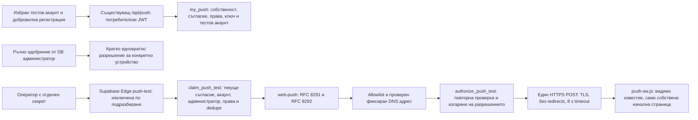

# МЕТЕО ПУЛС — ЕТАП 6Г-Б: сигурна единична тестова доставка

Дата: 9 октомври 2026 г. База: актуалният `main`, `5e5bb7811a5c2d9660337678f856b0578fb90009`, след слетите PR #61 и #62.

**Това е подготовка за преглед. Няма реално изпратено известие, Production ключове, Production SQL, промяна на реални устройства/настройки, активирана регистрация, доставка или Cron.** Новата миграция е отделна от вече приложената `20261009040000_web_push_preparation.sql`. Не се слива автоматично.

## Архитектура и граници на достъпа



Новата Edge Function е `supabase/functions/push-test/index.ts`. Старият `push-check` остава неактивен scaffold. Няма метео scheduler, изпращане по списък, цикъл през потребители, нов Vercel endpoint или бутон за административно изпращане. Тестовото съдържание е фиксирано на сървъра на BG/EN и не представлява истинско метео предупреждение. Service Worker остава без токени, секрети, fetch handler и външна навигация.

Четири независими условия преди реална доставка:

1. Supabase Edge secret `PUSH_TEST_DELIVERY_ENABLED=true` — липсата му и всяка друга стойност отказват заявката преди DB достъп.
2. Отделен, случаен `PUSH_TEST_OPERATOR_TOKEN` в `Authorization: Bearer …`. Потребителски JWT, anon/publishable ключ или скрит UI не са разрешение за изпращане. Няма CORS; browser `Origin` заявки се отказват допълнително.
3. Само DB owner може да включи `push_controls.test_delivery_enabled`. Клиентите и `service_role` нямат direct table grants.
4. DB owner трябва да създаде конкретен `push_test_permits` ред: акаунт, устройство, текущи ревизии, категория, език, действителен административен одобрител и срок до 15 минути. По подразбиране няма нито едно разрешение. Членството и състоянието на одобрителя се проверяват отново.

Тялото на Edge заявката е само `{"permitId":"<uuid>"}`, до 512 bytes. Не се приемат user/device ID, endpoint, URL, текст, категория или VAPID ключ от оператора/браузъра. Разрешението не е само тайна UUID: нужни са всички независими условия. Външните отговори не съдържат subscription данни или provider response bodies.

## Библиотека и криптография

Използва се [web-push 3.6.7](https://github.com/web-push-libs/web-push), текущата npm версия при проверката. `generateRequestDetails` генерира RFC 8291 `aes128gcm` body и RFC 8292 VAPID удостоверяване. Не се пишат собствени алгоритми за шифроване или JWT подписване. `ipaddr.js 2.5.0` проверява адресните диапазони. Версиите са фиксирани в npm lock и Deno import map/lock.

За доставка се използват native `Deno.connect` към проверения числов IP и `Deno.startTls` със същинското provider име за SNI/сертификат, преди да се запише шифрованото съобщение. Node HTTPS `lookup`/Agent/servername hooks не се спазват последователно в проверения Edge Runtime и не са използвани за Production транспорта. Малък ограничен HTTP/1.1 writer изпраща точно един POST с библиотечните headers/body; parser чете само до 4 KB response headers и затваря връзката. Не се изтегля или логва error body. Невалидни/прекалено големи headers и interim HTTP responses се отказват безопасно като uncertain. TLS проверката никога не се изключва.

Проверяват се каноничен base64url, размерите на ключовете, действителна P-256 точка, валиден private scalar, съвпадение на VAPID двойката и `mailto:`/HTTPS контакт. Генерирането на всяко съобщение използва нова криптографска случайност от библиотеката. TTL е 60 секунди, urgency е `very-low`. Разрешение на provider не гарантира, че браузърът е показал известието.

Изолираният тест дешифрова генерирания body със собствена временна ключова двойка на симулиран получател. Ключовете в тестовете са само в паметта или временни файлове, които се изтриват. Няма Production ключова двойка в PR.

## Environment variables и места за съхранение

| Променлива | Услуга/среда | Предназначение |
|---|---|---|
| `PUSH_VAPID_PRIVATE_KEY` | Само Supabase Edge Function secrets, отделна стойност за изолирания проект и Production | Частен P-256 scalar; никога GitHub, Vercel Preview, Vite, browser storage или SW |
| `PUSH_VAPID_PUBLIC_KEY` | Supabase Edge secrets; същата публична стойност в избраната Vercel среда и DB control | Удостоверява двойката и идентифицира ключа на конкретния subscription |
| `PUSH_VAPID_SUBJECT` | Supabase Edge secrets | Реален наблюдаван `mailto:` или HTTPS контакт с оператора |
| `PUSH_TEST_OPERATOR_TOKEN` | Supabase Edge secrets и личен password manager на одобрения оператор | Независим случаен base64url секрет от поне 32 bytes; без приложение/UI |
| `PUSH_TEST_DELIVERY_ENABLED` | Supabase Edge secrets | `false` по подразбиране; включване само след отделно одобрение |
| `SUPABASE_URL`, `SUPABASE_SERVICE_ROLE_KEY` | Автоматично предоставени от Supabase на Edge Function за съответния проект | Само тесните delivery RPC; никакви директни таблици |
| `PUSH_REGISTRATION_ENABLED` | Съществуващ Vercel server env | Остава `false`; няма нов публичен Vite флаг |

Секретите в Supabase са на ниво проект: достъпът до deployment кода/проекта е доверена административна граница. Не пренасяйте Production secret/service-role key във Vercel Preview. Preview за интеграция трябва да сочи към отделен Supabase проект с отделни акаунти и ключове. Само статичен Preview може да се проверява с подменени account API и без DB секрети. Този етап не променя никакви реални environment variables и не може да удостовери съдържанието на съществуващата Vercel конфигурация.

## Допълнителна SQL миграция

`20261009050000_web_push_test_delivery.sql` добавя:

- Изключен test gate, публичен VAPID key identifier, `registration_test_user_id` и глобален cooldown в `push_controls`.
- Nullable VAPID key identifier и subscription expiration в `push_devices`. Старите редове не се попълват или променят; не са допустими за изпращане без доброволна нова регистрация.
- `push_test_permits` с ENABLE/FORCE RLS, без grants за anon/authenticated/service role, без автоматично създадени разрешения.
- Три service-role-only RPC за claim, повторна авторизация и резултат; вътрешният predicate няма външни grants.
- Обвивка на `my_push(jsonb)` около запазената предишна реализация. Старият RPC е преименуван и всички клиентски grants са отнети. Регистрацията изисква избрания тестов акаунт и ключа от DB control. Публичният ключ идва от server env, а не от произволен клиентски параметър.

Миграцията не включва gates, не въвежда секрети, не променя абонаментни права, не добавя Cron и не изпълнява HTTP. При rollout първо се преглежда/прилага SQL в изолиран проект. Кодът с още стара Production схема отказва регистрация безопасно, понеже липсва съвпадащият DB key contract; load/settings/delete продължават по стария договор.

## Защити, грешки и оставащи рискове

- При claim и непосредствено преди POST се проверяват текущото съгласие, категориите/градовете, собственикът на устройството, ревизиите, VAPID identifier, сроковете, съществуването/блокирането/soft deletion на акаунта, active Free/Pro абонаментът и административният одобрител. Free не може да получи Pro категориите `walk/garden/sport`, включително след downgrade.
- Само прегледаните HTTPS endpoints за FCM, Apple, Mozilla и Windows са допустими. Забранени са IP URLs, userinfo, custom ports, fragments, suffix tricks и други paths/query. Всички DNS отговори трябва да са публични unicast адреси; смесени private/public резултати, mapped IPv6 и резервирани диапазони се отказват. HTTPS получава вече проверения IP като адрес за свързване, със запазени provider Host/SNI и включена TLS проверка. Няма второ свободно DNS разрешаване или redirect follow.
- DNS timeout е 3 s, всяко DB HTTP извикване — 5 s, provider POST — 8 s. Provider отговорът се чете до 4 KB headers, после връзката се затваря; body не се изтегля допълнително. Входът се чете ограничено, с deadline 2 s. Няма приложение, което логва endpoint, auth/p256dh/VAPID/operator ключ или сурова грешка.
- Global row lock и `(device_id,event_key)` unique ledger предотвратяват дублиране. Една нова резервация на минута за целия проект. След claim няма повторно използване; преди POST ledger преминава в `uncertain`, така че загуба на процеса/отговора не причинява второ изпращане. Авторизацията изтича до 30 s от claim.
- 404/410 и невалидна криптографска subscription се обезсилват чрез изтриване само ако устройството още е със същата ревизия. Нова регистрация не се изтрива заради стар provider отговор. Foreign-key cascade премахва свързаните permits/ledger; това е cleanup, не постоянен audit archive.
- 429 записва общ `next_test_after` от `Retry-After` секунди или HTTP дата; без header — 15 min. Минимумът е 60 s. Непредставимо/над една година изчакване изключва DB test gate вместо да съкращава ограничението. Същото разрешение никога не се повтаря, включително след cooldown. 3xx/други откази са terminal failed; timeout/загубен отговор остават непотвърдени.
- Има неизбежен кратък интервал между последната DB проверка и външния POST. Оттегляне след тази проверка не може да отмени вече прието от provider съобщение. TTL ограничава изчакването, но не е гаранция за незабавно изчезване. Видимото известие може да попадне на lock screen; тестовият текст няма лична информация.
- Изключеният gate и евтиният отказ без DB не са защита от изчерпване на платформената invocation квота. Endpoint остава мрежово достижим. Преди включване се преглеждат gateway/WAF/IP ограниченията, rate monitoring и redaction на стандартния Authorization header в платформени access logs. Тяхната Production конфигурация не е променяна или проверявана тук. Компрометирани DB owner/Edge deployment права са извън границата на клиентската RLS защита.

## Генериране, конфигуриране и ротация — само ръчни действия

След review, първо за отделен изолиран проект:

1. Изпълнете `npm ci`, после `node scripts/generate-vapid.mjs work/isolated-vapid.json` на доверена локална машина. Скриптът пише нов файл с mode `0600`, отказва overwrite/път извън `work` и не извежда ключове в stdout. Не го стартирайте за Production като част от CI/Preview build. Проверете, че `work` е игнориран от git.
2. Прехвърлете нужните стойности през password manager в Supabase Dashboard → Project Settings → Edge Functions → Secrets. Оставете `PUSH_TEST_DELIVERY_ENABLED=false`. Алтернатива: `supabase secrets set --env-file work/push-edge-secrets.env --project-ref <ИЗОЛИРАН_PROJECT_REF>` с частен файл `0600`; никога стойности като CLI аргументи, screenshot или PR коментар. Не презаписвайте резервираните `SUPABASE_*` имена.
3. Прегледайте новия SQL файл и го приложете **само към изолирания проект**. Проверете gates=`false`, key identifier и test user=`null`, permits count=0, revoke/grants. За Production е нужно отделно изрично одобрение; този PR не изпълнява SQL.
4. За отделен test deployment: `supabase functions deploy push-test --project-ref <ИЗОЛИРАН_PROJECT_REF>`. `supabase/config.toml` изключва платформената JWT проверка само за тази функция, защото собственото operator authentication е задължително. Това не изключва custom secret/DB gates. Проверете, че без флаг функцията връща 503 и не чете DB.
5. Vercel Preview трябва да използва отделния test Supabase URL/anon key и публичния VAPID ключ; `PUSH_REGISTRATION_ENABLED=false` до разрешен test enrollment. Няма нужда от Production service-role или VAPID private key във Vercel. Ако други съществуващи routes изискват service-role за тест, използвайте само изолирания проект, никога Production.
6. Изтрийте локалните private secret файлове след сигурното им съхранение. Прегледайте реалния Supabase runtime, egress/TLS/DNS поддръжката и стандартните log redactions преди доставка. Локалният runtime test не доказва конкретната Production конфигурация.

Ротация: първо спрете test gate и Edge flag, оттеглете неизползваните permits, генерирайте нова двойка на доверена машина и съгласувайте публичния identifier между Supabase Edge, DB и избраната Vercel среда. Не променяйте ключа на вече съхранени устройства. Те остават с предишния identifier и се отказват от sender. Браузърът сравнява `PushSubscription.options.applicationServerKey`; стар/неизвестен ключ изисква изрично отписване или reset на site notifications, след това ново доброволно абониране. Няма silent unsubscribe, прехвърляне между акаунти или background resubscribe. Загубена/компрометирана private двойка изисква тази процедура; не допускайте sender fallback към стария ключ. Operator token се сменя независимо и старият се отнема.

## Процедура за ЕДИН реален тест — НЕ Е ИЗПЪЛНЕНА

Нужно е изрично одобрение за конкретната среда, тестов акаунт и собствено устройство, ръчната конфигурация/SQL и точно едно реално известие. Препоръчителната първа среда е изолиран Supabase проект с отделен test origin. Production изисква отделно одобрение за всяка промяна; отварянето на този PR не го предоставя.

1. Проверете platform runtime/log redaction, всички изолирани тестове, Preview и identity на проекта. Потвърдете, че няма Cron и автоматичен dispatcher.
2. Конфигурирайте само одобрената среда. За доброволна регистрация задайте `push_controls.registration_test_user_id` на точно тестовия Auth UUID, `vapid_public_key` на проверения публичен ключ; разрешете registration gates само за тази стъпка. `my_push` отказва всеки друг акаунт, включително директно RPC. Самият тестов потребител избира град/категория, съгласие, browser permission и регистрира собственото си устройство. След запис върнете registration gates на `false`.
3. DB owner създава разрешение за точно проверените owner/device UUID; не се копират endpoint или auth keys в отчет. Примерен SQL **само след одобрение**, с прегледани UUID placeholders:

```sql
insert into public.push_test_permits
 (user_id,device_id,approved_by,device_revision,preferences_revision,category,language,expires_at)
select d.user_id,d.id,'<ОДОБРИТЕЛ_ADMIN_UUID>'::uuid,d.updated_at,p.updated_at,
 'wind','bg',clock_timestamp()+interval '5 minutes'
from public.push_devices d
join public.push_preferences p on p.user_id=d.user_id
where d.id='<ИЗРИЧНО_ОДОБРЕНО_DEVICE_UUID>'::uuid
 and d.user_id='<ИЗРИЧНО_ОДОБРЕН_USER_UUID>'::uuid
 and p.enabled and 'wind'=any(p.categories)
returning id;
```

4. Проверете, че е създаден точно един ред. Включете DB test gate и Edge flag за този одобрен тест. Подгответе private curl config (`0600`) със server URL, `Authorization: Bearer <операторски секрет>`, `Content-Type: application/json` и само `{"permitId":"…"}`. Извикайте `curl --config work/push-test.curl` **веднъж**, без `--verbose`, tracing, redirects или retries. Секретът не е в shell history/command line. Не използвайте browser/admin UI или production user JWT за изпращане.
5. При 200 документирайте само permit UUID, време, `PUSH_TEST_ACCEPTED` и дали собственикът реално видя известието. При 503/timeout не повторяйте: резултатът може да е uncertain. При 404/410 subscription е невалидна; при 429 изчакайте DB cooldown. Ново разрешение/опит изисква ново отделно одобрение.
6. Веднага върнете Edge flag и DB test gate на `false`, оттеглете оставащите permits, изтрийте частния curl config и проверете, че регистрацията е изключена. Отписването на тестовото устройство е отделно изрично действие на собственика. Няма действие върху други потребители.

## Безплатни ресурси

Проверени официални източници на 9 октомври 2026 г.: [Supabase runtime limits](https://supabase.com/docs/guides/functions/limits), [invocation pricing](https://supabase.com/docs/guides/functions/pricing), [billing quotas](https://supabase.com/docs/guides/platform/billing-on-supabase), [Vercel runtime limits](https://vercel.com/docs/functions/runtimes).

Supabase Free включва 500 000 Edge invocations месечно, 256 MB runtime memory, 2 s CPU/request и 150 s wall-clock; Free лимитът за брой функции е 100. DB е 500 MB/project и стандартният egress е 5 GB. Конкретната оставаща квота в акаунта не е достъпна тук. Едно известие означава една Edge invocation, до три тесни DB RPC и един encrypted provider POST; обичайно само няколко KB, без платена услуга, Redis, forecast downloads или постоянно polling. Това е оценка, не измерване на Production фактурата. Неоторизирани invocations също консумират квота.

Новите Vercel функции са **0**. Официалният локален `@vercel/node 23.0.0` builder потвърди същите 9 Lambda bundles; документираният Hobby лимит е 12. Supabase Free не е гаранция за безкрайна доставка: CPU, burst/DDoS, DB размер и egress трябва да се наблюдават преди бъдеща масова система. Cron и масова доставка не са част от този етап.

## Проверки и честни ограничения

- Node unit: 269 проверки преминаха, включително текущата библиотека, валидни/невалидни ключове, RFC дешифроване, SSRF/DNS, ротация, единично изпращане, дублиране и provider грешки. `node --test --test-isolation=none …` е допълнително използван, за да се отчетат действително отделните проверки в тази среда.
- Deno 2.9.6: typecheck на Edge entrypoint и 8 проверки преминаха, включително истински локален TLS provider и IP/SNI transport. Provider egress е симулиран; няма външен push POST.
- Официалният локален Supabase Edge Runtime `v1.76.2` (Docker image digest `sha256:edd22bef4477b900d5c300e287ce9b18bff9b81a0291bee14ee0b7c7b71a2899`) стартира реалния entrypoint в контейнер с `--network none`, без project secrets. HTTP отговорът е 503 `PUSH_TEST_DISABLED`.
- Същият runtime премина отделен in-memory сценарий: криптография, една симулирана доставка, отказ на duplicate, native Deno TLS POST до локален provider, отказ на 302 redirect и отказ на грешен certificate hostname преди HTTP payload. Provider е отделен Node контейнер в същия изолиран network namespace. Използвана е временна тестова CA със server certificate; TLS verification остава включена. Няма интернет, production secrets или реална DB в runtime сценариите. Възпроизвеждане: кеширайте npm dependencies с `DENO_DIR=work/deno-cache deno cache --config tests/edge-push/deno.json tests/edge-push/index.ts`, изтеглете посочения runtime image, `node:24-bookworm-slim` и `postgres:17-bookworm`, после `npm run test:push:edge`. Скриптът използва само локалния Docker socket, изолирани fixtures и автоматичен cleanup.
- Disposable PostgreSQL 17/PostgREST: старите SQL регресии и новата миграция/тест преминаха. Проверени са grants, default-off gates, ownership, consent/plan/account revocation между claim и authorize, expiration, duplicate authorization и 429 cooldown. Минималният Auth fixture не е реален Supabase GoTrue.
- Chromium dev server: 305 passed, 1 skipped (compiled-bundle проверката изисква отделния build config). BG/EN rotation: още 2 passed. Chromium compiled build: 64 passed, включително пропуснатата bundle проверка, профил, височини, Push и BG/EN. Пълният dev suite включва съществуващите известия, профил, планер, Free/Pro, registration, unsubscribe и permission denial. Всички account/weather API са изолирани fixtures; реалният PWA/SW тест използва локалния Chromium.
- `lint`, `typecheck`, `build` преминаха. Официалният Vercel builder потвърди 9 функции и 0 добавени. Vercel Preview резултатът се допълва след създаване на PR.

Реално затворен браузър, push provider acceptance/display, iOS устройство, конкретният hosted Supabase runtime, Production secrets/log policies и Production DB не са проверени с истинско изпращане. Това остава за единствения отделно одобрен реален тест.
